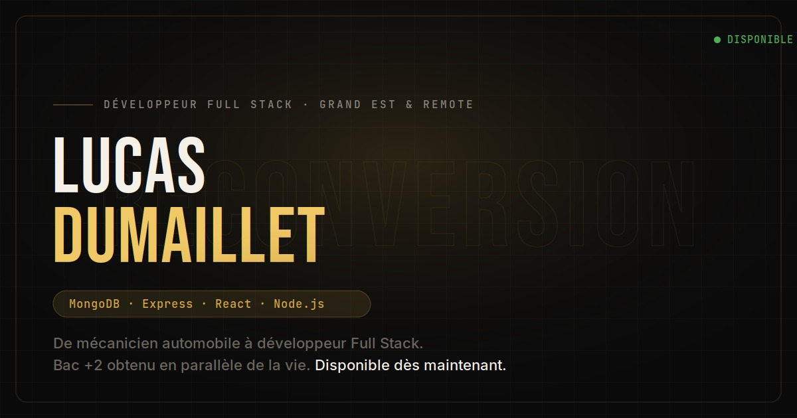

# Lucas Dumaillet — Portfolio Full Stack MERN

> De mécanicien automobile à développeur Full Stack. Un portfolio construit avec React + Vite, dans un esprit dark gold.



[](https://lucasdumaillet.dev)
[](https://react.dev)
[](https://vitejs.dev)
[](LICENSE)

---

## Aperçu

Portfolio professionnel développé de A à Z — design, développement et déploiement. Il présente mon parcours de reconversion, ma stack technique MERN et mes projets, tout en étant lui-même une démonstration de mes compétences en développement front-end.

**Lien live →** [lucasdumaillet.dev](https://lucasdumaillet.dev)

---

## Stack technique

| Couche      | Technologie                             |
| ----------- | --------------------------------------- |
| Framework   | React 18                                |
| Bundler     | Vite 5                                  |
| Styles      | CSS Modules                             |
| Icônes      | Font Awesome (SVG core)                 |
| Formulaire  | Web3Forms API                           |
| Canvas      | API Canvas native (particules)          |
| Déploiement | Vercel                                  |
| SEO         | Schema.org JSON-LD, Open Graph, sitemap |

---

## Fonctionnalités

- **Fond interactif** — canvas de particules dorées réagissant à la souris
- **Animations au scroll** — révélations via `IntersectionObserver`, sans dépendance externe
- **Timeline de parcours** — représentation visuelle de la reconversion automobile → développeur
- **Section projets** — cartes avec preview image, zoom au survol, badge "Démo non déployée"
- **Formulaire de contact fonctionnel** — envoi réel via Web3Forms, gestion des états (envoi / succès / erreur)
- **SEO complet** — meta tags, Open Graph, Twitter Card, données structurées JSON-LD, sitemap
- **Performance optimisée** — code splitting (vendor / fontawesome), lazy loading images
- **Responsive** — mobile first, menu burger animé
- **Accessibilité** — `aria-label`, sémantique HTML5, hiérarchie de titres correcte

---

## Structure du projet

```
portfolio-react/
├── public/
│   ├── logo.webp               # Favicon
│   ├── og-image.jpg            # Image Open Graph (1200×630)
│   ├── CV_Lucas_Dumaillet.pdf  # CV téléchargeable
│   ├── robots.txt
│   └── sitemap.xml
├── src/
│   ├── assets/
│   │   ├── logo.webp           # Logo navbar
│   │   └── projects/           # Screenshots des projets
│   ├── components/
│   │   ├── Nav.jsx             # Navigation fixe avec scroll detection
│   │   ├── Hero.jsx            # Section hero avec animations CSS
│   │   ├── About.jsx           # À propos + carte identité sticky
│   │   ├── Story.jsx           # Timeline parcours
│   │   ├── Skills.jsx          # Stack technique + bandeau MERN
│   │   ├── Projects.jsx        # Grille projets avec thumbnails
│   │   ├── Interests.jsx       # Centres d'intérêt
│   │   ├── Contact.jsx         # Formulaire + liens sociaux
│   │   ├── Footer.jsx          # Pied de page
│   │   └── Background.jsx      # Canvas particules animées
│   ├── hooks/
│   │   └── useReveal.js        # Hook IntersectionObserver custom
│   ├── styles/
│   │   └── global.css          # Design tokens CSS + reset
│   ├── App.jsx
│   └── main.jsx
├── index.html                  # SEO meta, JSON-LD, fonts
├── vite.config.js              # Build optimisé (chunks, minification)
└── vercel.json                 # Headers de sécurité HTTP
```

---

## Installation locale

```bash
# 1. Cloner le repo
git clone https://github.com/LDumaillet/portfolio-react.git
cd portfolio-react

# 2. Installer les dépendances
npm install

# 3. Lancer en développement
npm run dev
# → http://localhost:5173

# 4. Build de production
npm run build

# 5. Prévisualiser le build
npm run preview
```

---

## Configuration

### Formulaire de contact (Web3Forms)

Dans `src/components/Contact.jsx`, remplace la clé d'accès par la tienne :

```jsx
const WEB3FORMS_ACCESS_KEY = "ta-clé-web3forms-ici";
```

Obtiens une clé gratuite sur [web3forms.com](https://web3forms.com) — entre simplement ton email, la clé t'est envoyée immédiatement, sans création de compte.

> **Après déploiement** : restreins la clé à ton domaine dans le dashboard Web3Forms pour éviter le spam.

### URL canonique et Open Graph

Dans `index.html`, remplace l'URL par ton domaine réel :

```html
<link rel="canonical" href="https://www.tondomaine.dev/" />
<meta property="og:url" content="https://www.tondomaine.dev/" />
<meta property="og:image" content="https://www.tondomaine.dev/og-image.jpg" />
```

### Ajouter des screenshots de projets

Place tes images dans `src/assets/projects/`, puis dans `Projects.jsx` :

```jsx
// 1. Décommenter l'import
import imgCrypto from '../assets/projects/crypto.webp'

// 2. Décommenter la propriété image dans l'objet projet
{ id: 'crypto', image: imgCrypto, ... }
```

---

## Déploiement sur Vercel

```bash
# Option 1 — via l'interface Vercel (recommandé)
# vercel.com → Add New Project → Import depuis GitHub
# Vercel détecte automatiquement Vite

# Option 2 — via la CLI
npm install -g vercel
vercel
```

**Paramètres de build détectés automatiquement par Vercel :**

| Paramètre        | Valeur          |
| ---------------- | --------------- |
| Framework        | Vite            |
| Build command    | `npm run build` |
| Output directory | `dist`          |
| Install command  | `npm install`   |

Le fichier `vercel.json` inclus ajoute automatiquement les headers de sécurité HTTP (`X-Frame-Options`, `X-Content-Type-Options`, `Referrer-Policy`, `Permissions-Policy`).

---

## Design system

Palette et tokens définis dans `src/styles/global.css` :

```css
--bg: #0a0a0b /* fond principal */ --bg-card: #111114 /* cartes */
  --gold: #d4a843 /* couleur signature */ --gold-dim: rgba(212, 168, 67, 0.12)
  --ivory: #f5f0e8 /* texte principal */ --muted: #6b6760 /* texte secondaire */
  --ff-display: "Bebas Neue" /* titres */ --ff-body: "Inter" /* corps */
  --ff-mono: "JetBrains Mono" /* code / labels */;
```

---

## Performances

Score Lighthouse visé (et obtenu après build) :

| Métrique         | Score |
| ---------------- | ----- |
| Performance      | 90+   |
| Accessibilité    | 95+   |
| Bonnes pratiques | 95+   |
| SEO              | 100   |

Optimisations en place :

- Code splitting : `vendor` (React/ReactDOM) et `fontawesome` en chunks séparés
- Images en `.webp` avec `loading="lazy"`
- Polices Google Fonts avec `preconnect`
- Canvas désactivé sur mobile (réduction de charge)
- Aucune librairie d'animation externe (Framer Motion, GSAP) — tout en CSS natif + JS vanilla

---

## SEO

- **Meta tags** complets (title, description, keywords, author)
- **Open Graph** pour LinkedIn, Facebook (image 1200×630)
- **Twitter Card** `summary_large_image`
- **Schema.org JSON-LD** — type `Person` avec `knowsAbout`, `alumniOf`, `worksFor`
- **Sitemap XML** soumis à Google Search Console
- **robots.txt** autorisant l'indexation complète
- **URL canonique** pour éviter le contenu dupliqué

---

## Auteur

**Lucas Dumaillet** — Développeur Full Stack MERN

- Portfolio : [lucasdumaillet.dev](https://lucasdumaillet.dev)
- LinkedIn : [lucas-dumaillet-3558a235b](https://www.linkedin.com/in/lucas-dumaillet-3558a235b)
- GitHub : [@LDumaillet](https://github.com/LDumaillet)
- Email : [dumaillet.lucas@gmail.com](mailto:dumaillet.lucas@gmail.com)

---

## Licence

Ce projet est sous licence [MIT](LICENSE) — tu peux t'en inspirer librement, mais merci de ne pas le déployer tel quel comme ton propre portfolio.
